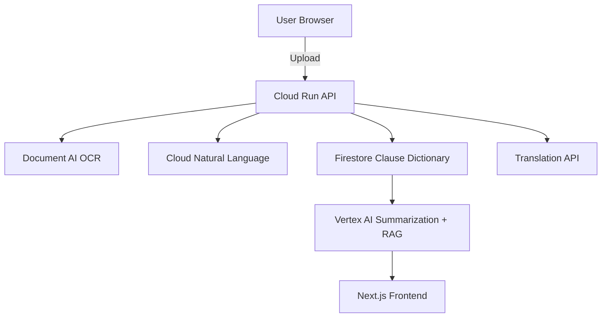

# 🏆 LegalSummary-AI
[]()
[](https://legalsummary-ai.vercel.app/)
[](https://github.com/omnipotentchaos/legalsummary.ai)


> *LegalSummary-AI* is a privacy-first Generative AI platform that *demystifies complex legal documents* into *clear, actionable guidance*.  
> Built on *Google Cloud* (Document AI + Vertex AI + Natural Language + Translation API) with a *Clause Dictionary* for consistent explanations.

---

## 🚀 What Is This?
Legal documents—rental agreements, loan contracts, terms of service—are filled with jargon.  
Our prototype extracts text, identifies clauses, summarizes them in plain language, *flags potential risks, and allows **chat-style Q&A* grounded in the original document.

### ✅ Key Highlights
- *Clause Dictionary* – reusable, human-verified explanations for recurring clauses (saves cost & increases consistency)
- *Privacy Toggle* – client-side redaction to prevent sensitive data upload
- *Multilingual Output* – summaries in user-selected language using Translation API
- *Suggested Questions* – pre-built “ask next” chips to guide non-experts
- *Grounded Chatbot* – Vertex AI + RAG ensures every answer cites the source clause

---

## 📸 Prototype Status
- ✔ *Working Upload → OCR → Summary flow* using Document AI & Vertex AI  
- ✔ Risk scoring & traffic-light UI  
- ✔ Firestore Clause Dictionary schema & API endpoints  
- ⏳ Chatbot with suggested Qs (partial demo)  
- ⏳ Multilingual export (MVP translation ready)  

---

## 🧑‍💻 Quickstart (Local Dev)

```bash
git clone https://github.com/omnipotentchaos/legalsummary.ai.git
cd legalsummary.ai
npm install   # or yarn
cp .env.example .env  # fill in your GCP credentials
npm run dev   # starts Next.js frontend + API routes
```

### Environment Variables (.env.example)
```bash
GCP_PROJECT_ID=<YOUR_PROJECT_ID>
GCP_LOCATION=<us-central1>
DOCUMENT_AI_PROCESSOR_ID=<processor_id>
VERTEX_MODEL_ID=<model_id>
FIRESTORE_COLLECTION=clauses
NEXT_PUBLIC_FIREBASE_API_KEY=<api_key>
```

---

## ☁️ Deploy to Google Cloud
Enable APIs

 gcloud services enable documentai.googleapis.com \
    aiplatform.googleapis.com \
    firestore.googleapis.com \
    run.googleapis.com


```bash
gcloud builds submit --tag gcr.io/$GCP_PROJECT/legal-summary-ai
gcloud run deploy legal-summary-ai \
    --image gcr.io/$GCP_PROJECT/legal-summary-ai \
    --platform managed \
    --region <REGION>
```

### Firestore Setup

```bash
gcloud firestore databases create --region=<REGION>
```

---

## 🧪 Testing & Health Check

### Run unit tests:
```bash
npm test
```

### Health Check Endpoint:
```bash
curl -s http://localhost:4000/api/health | jq
# Expected:
# { "status":"ok", "services": { "document_ai":"ok", "vertex_ai":"ok" } }
```

---

## 🗺 Architecture



---

## 👩‍⚖️ Judge One-Pager

### Problem
Most people sign contracts they don't understand, exposing themselves to legal and financial risk.

### Solution
LegalSummary-AI simplifies complex legal documents using Google Cloud Generative AI. Users upload a contract, optionally redact sensitive data, and receive plain-language clause summaries, risk flags, and actionable guidance in their preferred language. A Clause Dictionary ensures consistent explanations across documents, reducing cost and improving reliability.

### Impact
- Empowers citizens, small businesses, and NGOs to make informed decisions
- Reduces reading time and misinterpretation risk
- Scales globally through API licensing and B2B partnerships

### Technical Merit
Built entirely on Google Cloud: Document AI (OCR), Vertex AI (summarization & chat), Natural Language (entity extraction), Translation API (multilingual output), Firestore (clause storage), Cloud Run (serverless deploy).

### Why We Should Win
A working, privacy-first prototype demonstrating technical depth, social impact, and scalability—with reproducible tests, cost controls, and a clear roadmap to production.

---

## 📊 Cost Estimate (Prototype Scale)

| Tier | Docs/Month | Est. Cost* |
|------|------------|------------|
| Low  | 1,000      | $50        |
| Mid  | 5,000      | $250       |
| High | 20,000     | $900       |

*Includes Document AI pages, Vertex AI calls, Cloud Run compute, and Firestore ops. Costs reduced by Clause Dictionary reuse and caching.

---

## 🛠 Tech Stack

- **Frontend**: Next.js + Tailwind + Vercel/Cloud Run
- **Backend/API**: Node.js (Next.js API routes)
- **Database**: Firestore (NoSQL)
- **AI Services**: Document AI, Vertex AI, Natural Language, Translation API
- **Infra/Security**: Cloud Storage, KMS, IAM, Cloud Build CI/CD

---

## 🧩 Folder Structure

```
/pages          # Next.js pages & API routes
  /api          # Backend API endpoints
/components     # UI components
/lib            # GCP helper functions & services
/styles         # Global CSS
/scripts        # Utility scripts
```

---

## 📅 Roadmap

- **MVP (Hackathon)**: Upload → Summary → Risk → Clause Dictionary
- **v1.0**: Full chatbot with suggested Qs + Multilingual PDF export
- **Scale**: B2B API + NGO outreach + marketplace integrations

---

## 📝 Submission Checklist

- [ ] Update README.md
- [ ] Attach PDF deck `GenAI_LegalSummary_Prototype.pdf`
- [ ] Upload 3-minute demo video to YouTube/Vimeo


---
